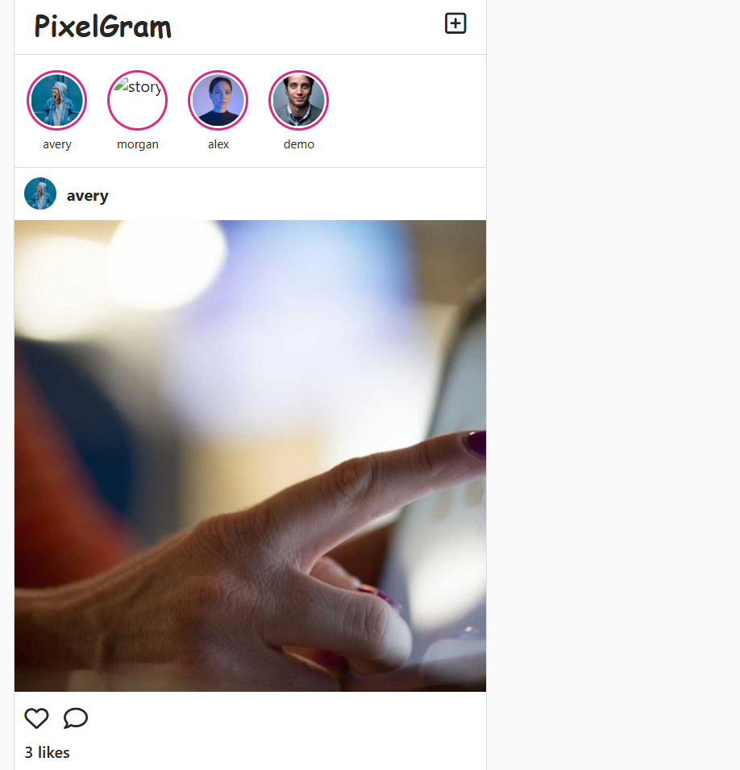
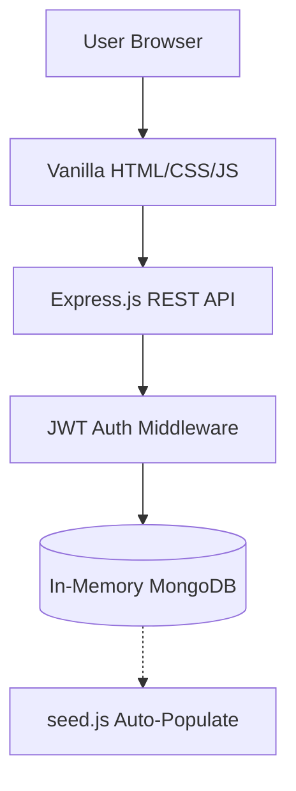

<div align="center">


# 📸 PixelGram

### A complete, production-quality mini social media web app styled and functioning like Instagram.

<br/>

[](https://pixelgram-omega.vercel.app/)
[]()
[](LICENSE)

[]()
[]()
[]()
[]()
[]()
[]()

</div>

---

## 🌐 Live Demo

<div align="center">

### Try the live website here 👇

<a href="https://pixelgram-omega.vercel.app/">
  
</a>

<br/><br/>

| Account | Credentials |
| :--- | :--- |
| **Demo Login** | `demo@pixelgram.com` / `demo1234` |

</div>

---

## 🚀 How to Run Locally

You do **not** need to set up a database to run this project locally! It uses `mongodb-memory-server` for a zero-setup experience.

<div align="center">

### Start the app with two commands 👇

```bash
npm install
npm start
```
</div>

---

## 📸 A Look Inside — App Trailer

<div align="center">

<b>🏠 Home Feed — Posts, Stories, and Interactions</b>



</div>

<table>
  <tr>
    <td width="50%"><b>🔐 Login / Signup</b><br/><i>Add your screenshot here (e.g. <code>public/assets/login.png</code>)</i></td>
    <td width="50%"><b>👤 User Profile</b><br/><i>Add your screenshot here (e.g. <code>public/assets/profile.png</code>)</i></td>
  </tr>
  <tr>
    <td width="50%"><b>🎥 Reels Feed</b><br/><i>Add your screenshot here (e.g. <code>public/assets/reels.png</code>)</i></td>
    <td width="50%"><b>➕ Create Post Modal</b><br/><i>Add your screenshot here (e.g. <code>public/assets/create.png</code>)</i></td>
  </tr>
</table>

---

## ✨ Features

<table>
  <tr>
    <td width="33%">
      <h3>👤 User Profiles</h3>
      Full signup, login, logout flow. Edit bio and view user-specific post grids.
    </td>
    <td width="33%">
      <h3>📝 Posts & Comments</h3>
      Create posts with image URLs and captions. Comment on posts and delete comments.
    </td>
    <td width="33%">
      <h3>🤝 Like/Follow System</h3>
      Follow and unfollow other users, and like/unlike posts with live count updates.
    </td>
  </tr>
  <tr>
    <td>
      <h3>📖 Stories</h3>
      Horizontal Stories bar. Tap to view full-screen with auto-advancing progress bars.
    </td>
    <td>
      <h3>🎥 Reels</h3>
      Vertical scrolling short-video feed with dedicated likes and comments.
    </td>
    <td>
      <h3>📱 Responsive Design</h3>
      Mobile-first Instagram-style layouts with bottom tab navigation on small screens.
    </td>
  </tr>
  <tr>
    <td>
      <h3>🎨 Modern UI</h3>
      Clean CSS styling matching Instagram's dark/light adaptable aesthetic.
    </td>
    <td>
      <h3>🌱 Automated Seeding</h3>
      Database automatically populates 10 demo accounts, 30+ posts, stories, and interactions.
    </td>
    <td>
      <h3>🔒 Secure Auth</h3>
      JWT-based sessions and bcrypt password hashing for user security.
    </td>
  </tr>
</table>

---

## 🧰 Tech Stack

| Layer               | Technology                                                |
| :------------------ | :-------------------------------------------------------- |
| **Frontend**        | Vanilla HTML5, CSS3, JavaScript                           |
| **Backend**         | Node.js, Express.js REST API                              |
| **Database**        | MongoDB (via `mongoose` and `mongodb-memory-server`)      |
| **Authentication**  | JSON Web Tokens (JWT) & bcryptjs                          |
| **Demo Content**    | Unsplash (Avatars), Picsum (Posts), Google Cloud (Videos) |

---

## 🏗️ Architecture

The app is built as a lightweight Single Page Application (SPA). The Vanilla JS frontend dynamically fetches data from the Express REST API, while state is managed in the client.



---

## 📁 Project Structure

```text
pixelgram/
├── public/                 # Static Frontend Assets
│   ├── assets/             # Logos and Screenshots
│   ├── css/                # style.css (Instagram theme)
│   ├── js/                 # app.js (SPA logic & API calls)
│   └── index.html          # Main application layout
├── backend/                # Express API Backend
│   ├── middleware/         # auth.js (JWT validation)
│   ├── models/             # Mongoose Schemas (User, Post, Comment, Story, Reel)
│   ├── routes/             # API Endpoints
│   └── server.js           # Server entry point & DB connection
├── seed.js                 # Automated demo data generation
├── package.json            # Node dependencies
└── README.md               # Documentation
```
